# Prediction Of Plastic Bottles Pollution With Linear Regression

## Executive Summary
The project aims to predict trends in plastic bottle litter from major manufacturers using a linear regression model. Sourced from Kaggle dataset ([URL link](https://www.kaggle.com/code/wastebase/country-of-manufacture-vs-detection/output?scriptVersionId=188923245)) was selected for its sufficient amount of records and its linkage to specific manufacturers, enabling a focused analysis of plastic waste trends.
Initial findings unsurprisingly indicate Coca-Cola with the highest projected increase in plastic bottle waste
in the next two years w. Overall, the trends show consistent growth in plastic waste across all manufacturers, signalling an upward trajectory in plastic bottle littering unless serious interventions are implemented.

## Project Background
Project is driven by strong personal opposition to littering and single-use plastics. The row data is available in CSV format, with one CSV file per month of data.
The results are planned to be presented via social media.
I believe that raising awareness can encourages more people to reconsider their choices before purchasing another bottle of Coca-Cola or Pepsi. 

## Methodology
The methodology for this project involved using a linear regression model to predict future plastic bottle waste trends based on historical data from major manufacturers. Linear regression was selected for its simplicity and effectiveness in capturing time-based trends, particularly given the dataset's moderate size (12 000 rows) and clear temporal structure.

## Data Security and Ethical Considerations
Transparency in the analysis was prioritized to ensure that the findings are used to support genuine environmental improvements rather than unfairly targeting specific manufacturers.
Additionally, any findings should be used to promote positive environmental change, avoiding misuse for greenwashing or misrepresentation of sustainability efforts.

## Data Collection and Preparation
The initial step starts with  csv files ingestion into SQL Server
Data Quality check included the following steps:
1. Imported fields format adjusted:
   
   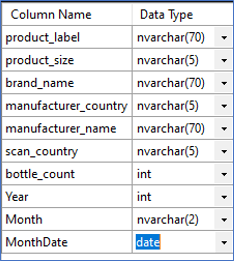

2. Unrecognised manufacturers excluded:
   
   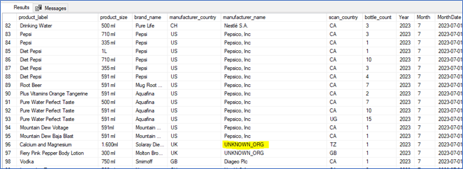

3. Inconsistent product_size values were addressed by splitting size and measurement units into separate fields and then recombined for consistency:

   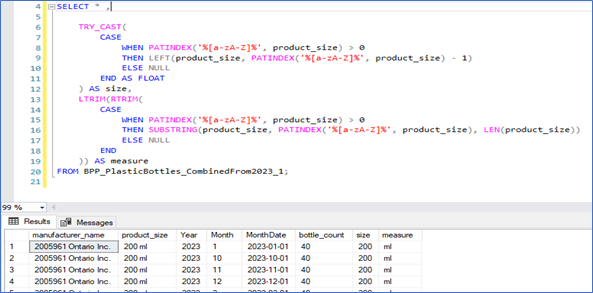
   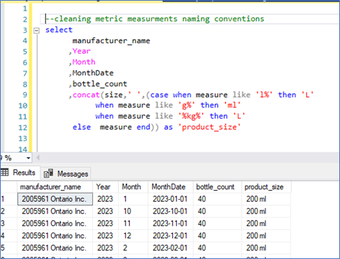

4. Manual entry errors, too small or too big bottle sizes excluded:
   
   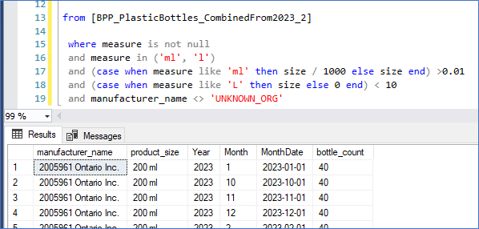

5. Manufacturers ranked to identify those with the highest to lowest contributions to total plastic waste for further top 20 selection:

   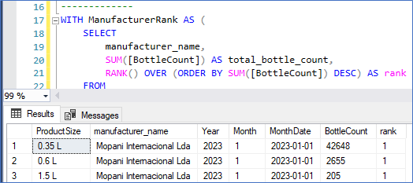

## Data Analysis

After data preparation, an initial correlation analysis asessed relationships between key variables. It revealed very weak relationships between ProductSize as shown on Figure 7 and the other variables (e.g., correlation with manufacturer_name was -0.054, and with Year, it was 0.008) and therefore ProductSize has been excluded from subsequent modeling.

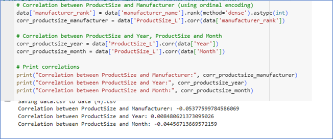

The next step involved the selection of a linear regression model. Individual linear regression models were trained for each manufacturer using the temporal data to forecast waste trends over the next two years:

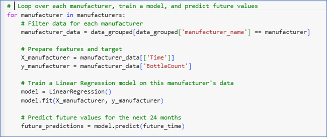

The models provided predictions of gradual, consistent growth in plastic bottle waste for most manufacturers, with Coca-Cola unsurprisingly  showing the highest volume but Universal Industries ( known for its still water products) came with highest  projected increase as illustrated in Figures 9 to 11.
These predictions, visualized across different manufacturers, highlighted the growing environmental impact of plastic bottle waste, underscoring the importance of sustainable interventions.

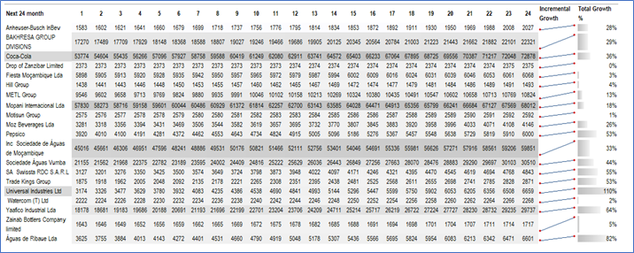
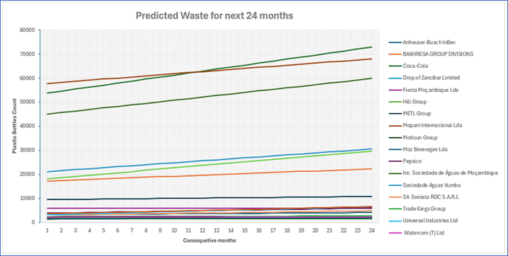
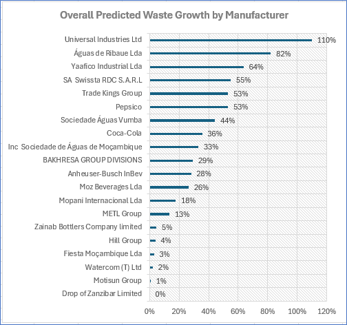

## Conclusion and Future Recommendations

This project predicts plastic bottle waste growth by manufacturer based on litter found in the environment. A key limitation is the lack of information whether there were consistent data collection practices. 
The linear regression model used assumes a steady growth rate, which may not account for sudden shifts in consumption or environmental efforts. Future iterations should consider using more robust time series models, such as ARIMA or Random Forest Regressor, to better capture complex trends and unexpected variations. 
This project’s results serve as a foundation for future research, where more complex models and broader datasets could offer deeper insights. Ultimately, the work emphasizes the importance of accurate data collection and predictive analysis in shaping effective waste management and reduction strategies.
The findings align with existing knowledge on the environmental impacts of plastic waste, reinforcing concerns about the steady rise in pollution and the urgent need for more sustainable practices.

